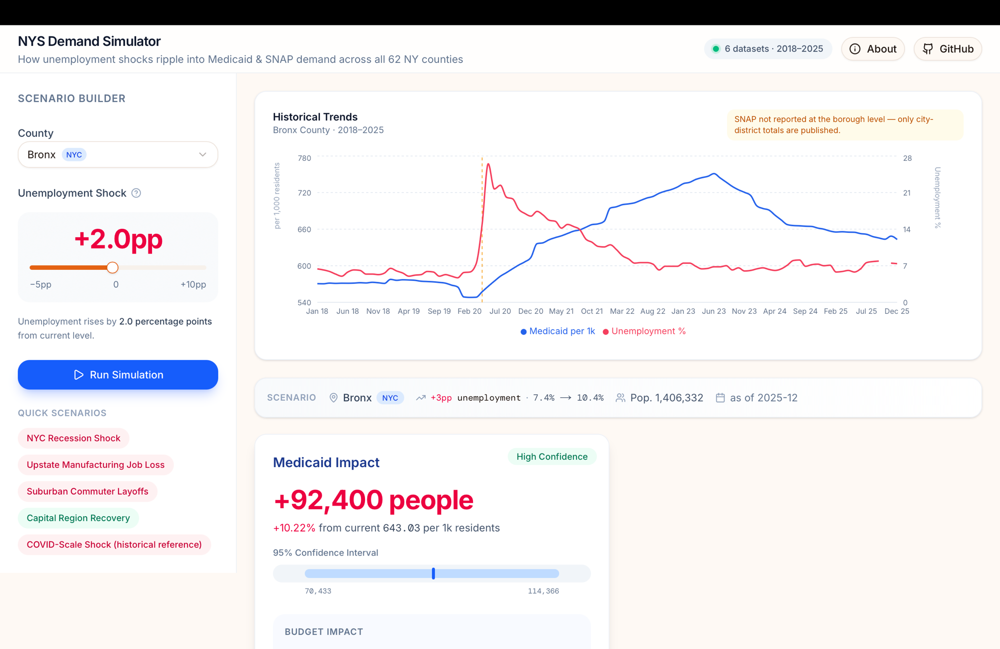

# NYS Public Demand & Policy Impact Simulator

**A self-service analytics tool that lets county-level planners in New York State estimate, in 30 seconds, how an unemployment shock would ripple into Medicaid and SNAP demand — without pulling six datasets by hand or building a spreadsheet model from scratch.**

### 🔗 [Try it live → nys-public-demand-simulator.vercel.app](https://nys-public-demand-simulator.vercel.app)

[](https://nys-public-demand-simulator.vercel.app) [](#) [](#) [](#)

> _Built by [Vignesh Dinesha](https://github.com/vigneshdinesha) — a portfolio project demonstrating end-to-end data engineering, statistical modeling, and full-stack delivery on real New York State public data._

<p align="center">
  <a href="https://nys-public-demand-simulator.vercel.app">
    
  </a>
</p>

<p align="center">
  <a href="https://www.loom.com/share/5b2a4ccf7f954d818bade26ad941ac9d">
    
  </a>
  <br />
  <strong><a href="https://www.loom.com/share/5b2a4ccf7f954d818bade26ad941ac9d">▶ Watch the 90-second demo</a></strong>
</p>

> ⚡ The backend runs on Render's free tier — the **first request after idle takes ~30 seconds** to spin up, then snaps back to fast.

---

## What it does

Pick a county. Set an unemployment shock (e.g. _"Bronx, +3 percentage points"_). In one click the simulator returns:

- **Predicted change in Medicaid enrollment** (headcount, % change, 95% confidence interval)
- **Predicted change in SNAP enrollment** with the same statistical envelope
- **Annual budget impact** at the county's actual cost-per-enrollee
- **Additional caseworkers needed** at standard OTDA staffing ratios
- **Honest confidence tier** (high / moderate / low) — flags when the model is weak so planners don't act on noise

It is **not** a forecasting system, not an actuarial replacement, and not equally reliable across every county. Those caveats are surfaced inside the app, not buried in a footnote.

## Why this is interesting (the engineering, not the modeling)

The headline isn't the regression. The headline is **getting six fragmented NYS datasets into one queryable shape in the first place** — none of them have ever been joined before.

| Dataset | Source | What made it hard |
|---|---|---|
| **Medicaid enrollment** | NYS Dept. of Health | **Not published as structured data.** County-level numbers exist only inside per-month PDF reports. Built a dedicated ingestion pipeline that extracts, validates, and normalizes them into an auditable time series. |
| Unemployment (LAUS) | NYS Dept. of Labor | Clean monthly CSV from data.ny.gov; standard. |
| SNAP caseloads | NYS OTDA | Borough-level for NYC, county-level elsewhere — geography reconciliation needed. |
| Motor-vehicle crashes | NYSDOT | Daily incident granularity rolled up to monthly per-county. |
| MTA monthly ridership | MTA | System-level; joined for transit-exposure feature engineering. |
| Population | U.S. Census Bureau | Annual ACS estimates interpolated to monthly. |

Final unified panel: **~67,000 county-month observations, 88 columns, 2018–2025.** Loaded to Postgres (Neon), served via FastAPI, consumed by a Next.js dashboard.

The Medicaid PDF extraction pipeline lives in [`data/extract_medicaid.py`](data/extract_medicaid.py). It's the piece I'm most proud of — the rest of the project is a thin layer on top of a dataset that didn't exist before.

## Architecture

```
                ┌─────────────┐
                │  data/raw/  │  (CSV downloads + DOH PDFs)
                └──────┬──────┘
                       │
                       ▼
        ┌───────────────────────────────┐
        │  Python ETL                   │
        │  • clean_unemployment.py      │
        │  • clean_population.py        │
        │  • extract_medicaid.py  ←  PDF→structured pipeline
        │  • etl.py        (merge, join, derive per-capita rates)
        └──────────────┬────────────────┘
                       │
                       ▼
                 ┌───────────┐
                 │ Postgres  │   (Neon — managed)
                 │ nys_unified table
                 └─────┬─────┘
                       │
       ┌───────────────┴───────────────┐
       ▼                               ▼
┌──────────────┐               ┌─────────────────┐
│ regression.py│  → coefficients│ analysis.py    │
│  (region OLS │     + pickled  │ (lag analysis, │
│   models)    │     models     │  COVID checks) │
└──────┬───────┘                └─────────────────┘
       │
       ▼
┌──────────────────┐         ┌───────────────────┐
│ FastAPI          │ ←─────→ │ Next.js dashboard │
│  • /simulate     │  JSON   │ • Scenario picker │
│  • /historical   │         │ • Confidence tier │
│  • /scenarios    │         │ • Budget impact   │
└──────────────────┘         └───────────────────┘
```

## Honest limitations

These are surfaced inside the app's **About** modal — they belong here too:

- **Not a forecaster.** R² peaks at ~0.22 even for the strongest regression. The simulator estimates a shock-induced delta on top of an existing baseline trajectory, because monthly enrollment is highly autocorrelated.
- **Not equally reliable across counties.** NYC Medicaid has a statistically significant signal (p<0.001). Upstate counties don't — driven more by demographic and disability caseloads than by labor-market fluctuations. The UI flags this explicitly.
- **SNAP for NYC is reported by city district, not borough**, so per-borough SNAP impact cannot be estimated from this model.
- **Not a replacement for actuarial or budget-office modeling.** It's a 30-second planning sketch, not a binding projection.

## Tech stack

| Layer | Tools |
|---|---|
| Data ingestion | Python · pandas · PDF-extraction pipeline |
| Storage | PostgreSQL (hosted on Neon) · SQLAlchemy |
| Modeling | statsmodels OLS with HC-robust standard errors · joblib |
| API | FastAPI · pydantic · uvicorn |
| Frontend | Next.js 16 (Turbopack) · TypeScript · Tailwind v4 · Recharts · lucide-react |
| Deployment-ready | Vercel (frontend) · Render/Fly (backend) · Neon (database) |

## Run it locally

**Prerequisites:** Python 3.11+, Node 20+, a Postgres database (free Neon instance works).

```bash
# 1. Backend
git clone https://github.com/vigneshdinesha/nys-public-demand-simulator.git
cd nys-public-demand-simulator
python3 -m venv .venv && source .venv/bin/activate
pip install -r requirements.txt
cp .env.example .env       # then fill in DATABASE_URL
uvicorn main:app --reload --port 8000
```

Auto-generated API docs at <http://localhost:8000/docs>.

```bash
# 2. Frontend (in a second terminal)
cd dashboard
npm install
npm run dev
```

Open <http://localhost:3000>. The dashboard auto-runs the NYC recession preset on load.

To rebuild the dataset from scratch you'll also need the raw CSVs (excluded from this repo — they total 343 MB). Download links are in [`data/raw/SOURCES.md`](data/raw/SOURCES.md).

## Repository layout

```
.
├── etl.py                   # 6-dataset ingestion + merge
├── analysis.py              # lag analysis, COVID validation
├── regression.py            # region-specific OLS models
├── simulate.py              # SimulationEngine class
├── main.py                  # FastAPI app
├── data/
│   ├── extract_medicaid.py  # PDF → structured time-series pipeline
│   ├── clean_unemployment.py
│   ├── clean_population.py
│   ├── processed/           # cleaned per-source CSVs
│   └── outputs/             # unified panel + diagnostics
├── dashboard/
│   └── src/
│       ├── app/             # Next.js routes
│       ├── components/      # ScenarioBuilder, SimulationResults, ConfidenceBadge, …
│       └── lib/             # types + API client
├── model_coefficients.csv   # regression outputs consumed by simulator
├── region_models.pkl        # serialized statsmodels objects
└── requirements.txt
```

## License

MIT — see [`LICENSE`](LICENSE).
